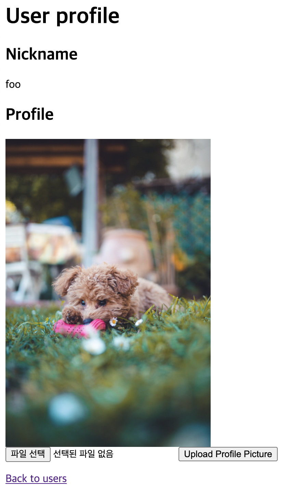

# Express Example



```
node src/main.js
```

`localhost:5000/users/15`에 접속해 봅니다.

## 프로필 사진 업데이트 기능

파일 선택 인풋을 클릭해 적당한 이미지 파일을 선택한 후, *Upload Profile Picture* 버튼을 누릅니다.

이후 `localhost:5000/users/15`로 돌아와 프로필 업데이트가 잘 되었는지 확인합니다.

## 유닛 테스트

[Jest와 supertest를 활용한 테스트](./src/app.spec.js)가 준비되어 있습니다. 프로젝트 루트에서 다음을 실행합니다.

```bash
npm test
```
