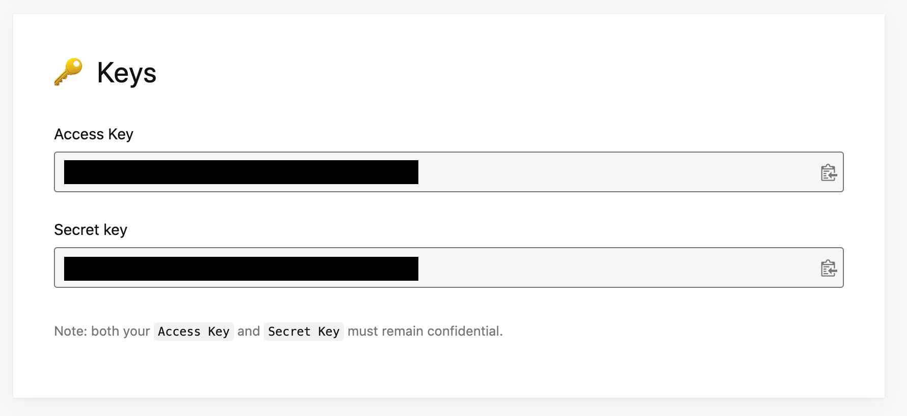

# Image Resizer

[Unsplash](https://unsplash.com/)에서 키워드로 이미지를 검색해 원하는 사이즈로 내려주는 리사이저입니다.

Unsplash에서 [개발자 등록](https://unsplash.com/developers)을 마치고, 어플리케이션을 만든 후, 다음 스크린샷과 동일한 부분을 참조해 `.env` 파일을 업데이트합니다.


위의 *Access Key*에 해당하는 값을 환경변수 `UNSPLASH_API_ACCESS_KEY`의 값으로 사용합니다.

```bash
UNSPLASH_API_ACCESS_KEY=accesskey
```

이제 `node src/main.js`를 실행한 후, `localhost:5000/flower?width=300`에 접속해 봅니다.
