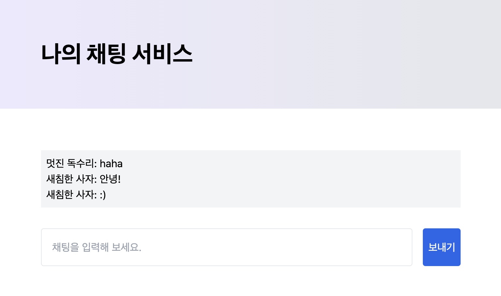
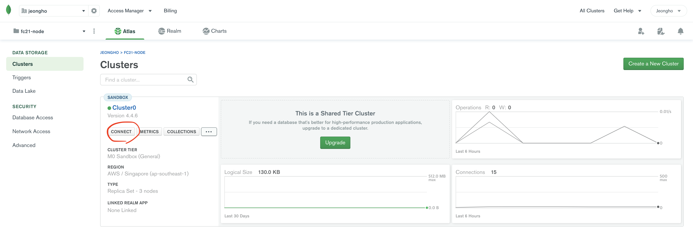
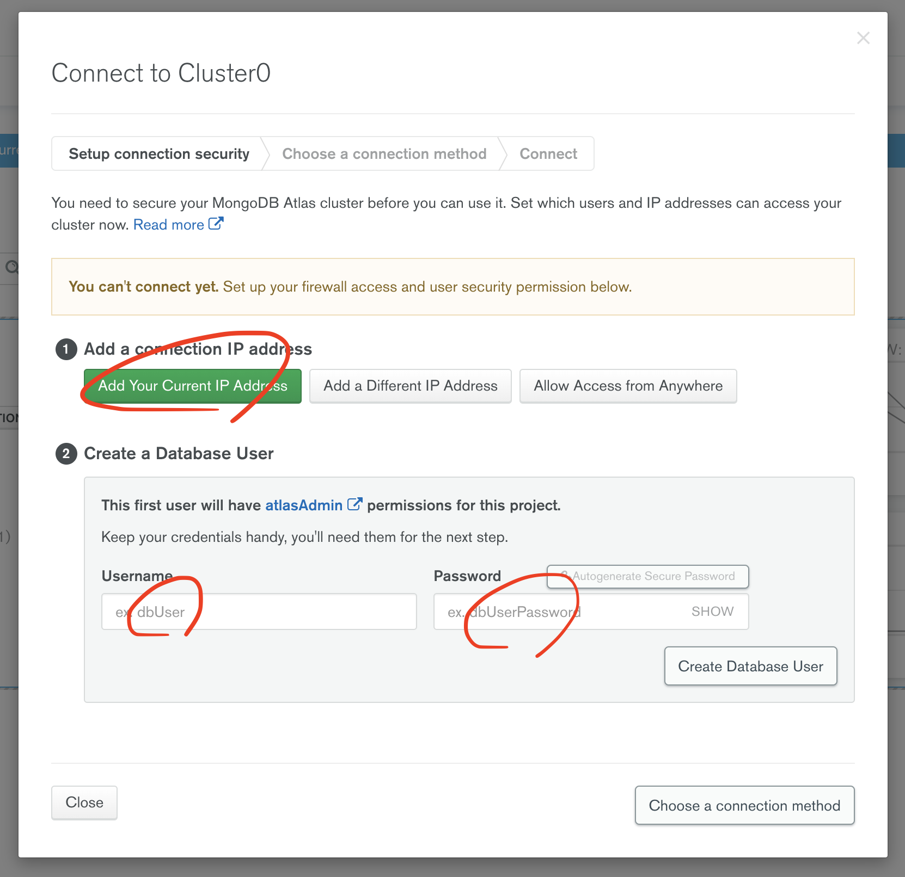
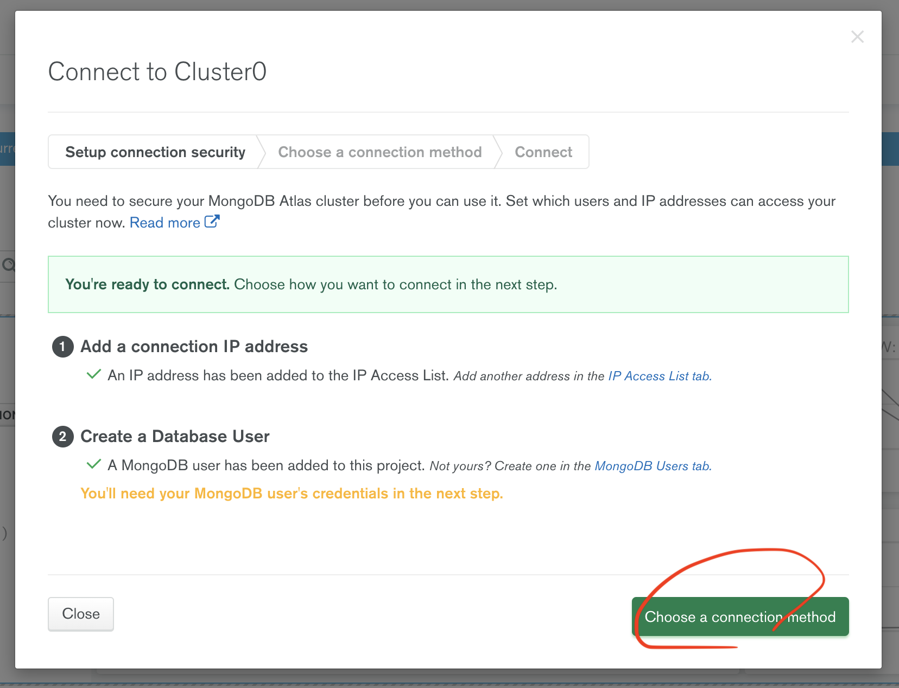
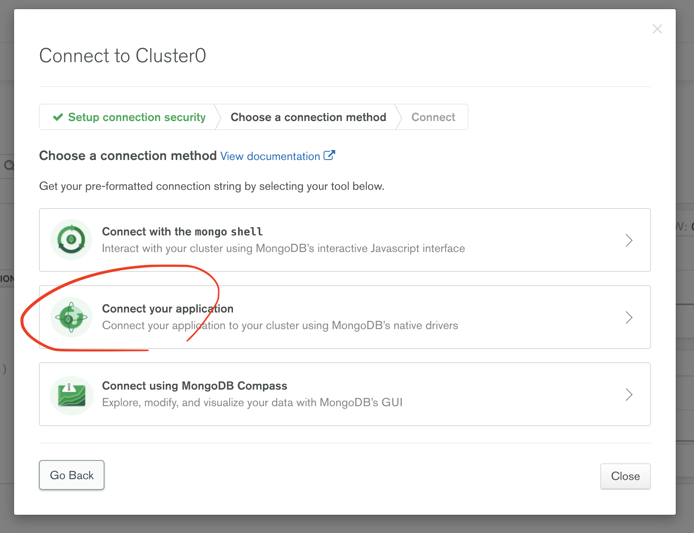
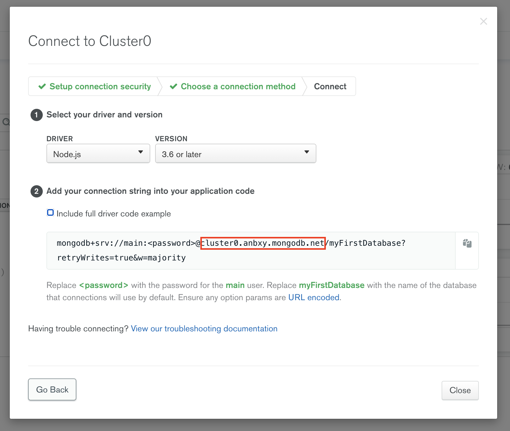

# Live Chat Interaction



환경변수에 다음 값들을 지정하거나, 이 `README.md` 파일과 동일한 위치에 `.env` 파일을 만드신 후 다음 내용들을 작성합니다.

```bash
MONGO_USER=myusername
MONGO_PASSWORD=mypassword
MONGO_HOST=cluster0.mongo.host.net
MONGO_DATABASE=mychatdb
```

[MongoDB Atlas](https://www.mongodb.com/cloud/atlas)를 사용하신다면 `MONGO_USER`, `MONGO_PASSWORD`, `MONGO_HOST`에 들어가야 할 값들은 다음과 같이 구할 수 있습니다.


MongoDB Atlas에서 데이터베이스 클러스터가 생성되었으면 위와 같은 상태가 됩니다. 클러스터의 *Connect* 버튼을 눌러 접속 설정을 시작합니다.


현재 IP에서 데이터베이스에 접속할 수 있도록 하고, 데이터베이스 유저 이름(`MONGO_USER`)과 비밀번호(`MONGO_PASSWORD`)를 설정합니다.


설정을 마치고 나면 위와 같은 상태가 됩니다. *Choose a connection method*를 눌러 다음 단계로 갑니다.


*Connect your application* 옵션을 선택합니다.


`MONGO_HOST`에 해당하는 값은 위의 빨간 박스가 쳐진 부분에 해당합니다.

`MONGO_DATABASE`는 사용할 기본 데이터베이스로, 없다면 자동 생성되기 때문에 적절한 이름으로 지정하시면 됩니다.

```bash
node src/main.js
```

이후 브라우저로 `http://localhost:5000`에 접속해 테스트합니다.
